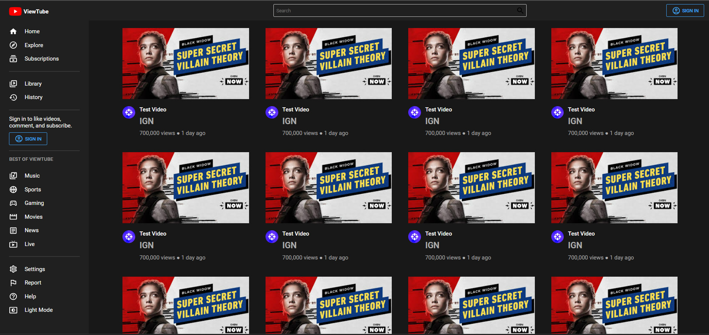
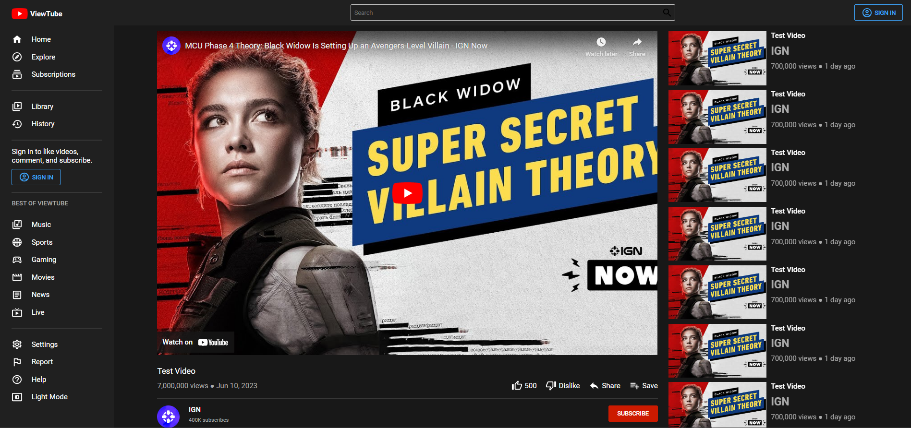
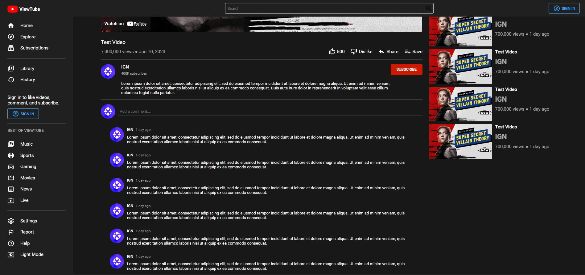
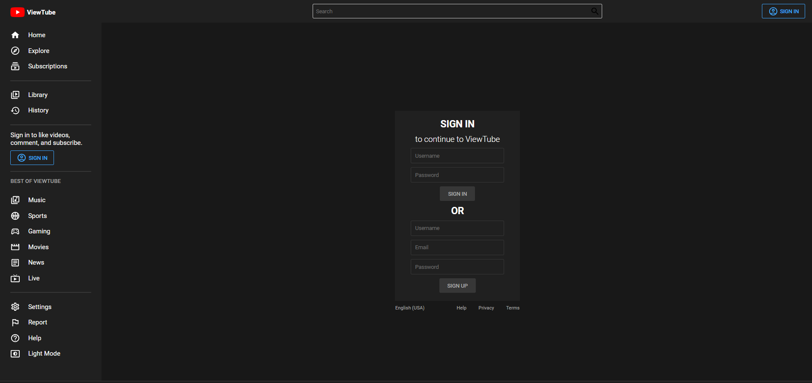

<h1 align="center"> ViewTube </h1>

## Technologies 🛠️

- HTML, JavaScript
- ReactJS
- Styled-Components

## Installation 💻

- Clone the Repository
     
```bash
    https://github.com/Sudeep-Poojary/ViewTube.git
```

## Screenshots 📸

<div align="center">










</div>